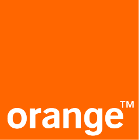

## Stanislas Paliard    
### Développeur web      
&nbsp;
    Dernière actualisation: 2021-03-31T09:47:10.4093832Z
&nbsp;
> Hello, bienvenue sur mon CV.
> Bonne lecture ! 

nov 2019 -> aujourd'hui : **CONCEPTEUR DÉVELOPPEUR CHEZ _ORANGE_**
  
  
* modernisation des process de déploiement
* migrations Php
* rénovation d'application
* développements PhP
* développement d'APIs
* passage en mode cloud
  _Technos :_ `Php5.3` / `php7.2`, `xml`, `MariaDB` `10.3.13`, `HTML`, `CSS`, `JS`, `JQuery`, `JQuery`-`UI`
  `symfony 3`, `zend`, `custom`
  `Jenkins`, `gitlab` `ci/cd`
  `cloudfoundry`, `amazon` `S3`

Exemple de réalisations :
* module recherche dans l'annuaire interne
* synchronisation de fichers avec des partenaires, intégration en RAW insert SQL
* conception d'un sytème de diffusions d'évènements par mail et SMS
* ...
   
jul 2017 -> oct 2019 : **INGÉNIEUR RÉALISATEUR CHEZ _MISTER AUTO_**
  
  
* assurer l'évolution de la partie legacy (cohabitation de 2 socles techniques)
* développements front/back en PhP pour les sites web desktop et mobile
* développement d'APIs (fournir des données au nouveau socle)
* contrôler la mise en recette de la partie legacy du site
 **Domaines :**
* e-commerce
* SEO
* UX/UI
 
 _Technos :_ `HTML`, `XML`, `CSS`, `JS`, `Code Igniter`, `JQuery`, `Mysql` `5.2`
  Exemple de réalisations :
* générateur de sitemaps pour les 22 pays
* création d'une API pour obtenir en temps réel les bannières promotionnelles
* évolutions sur les comptes professionnels (gestion d'opérations dédiées)
* refonte CSS du checkout
* ajout d'un nouveau PSP
* refonte du sélecteur "chaînes à neige" avec ajout de la compatibilité véhicule
* implémentation de market places
* externalisation d'une partie du customercare
* développement de scripts bash/commandes git pour automatiser la mise en recette

apr 2012 -> sep 2015
Développeur SQL/sqr chez Akanea
  
  
* Développement pour l'EDI (in/out)
* patchs correctifs, personnalisations
* analyse fonctionnelle et technique
  technos :
  `sqr`, `Oracle` `PL/SQL`, `ORACLE FORMS`, `DOS`, `Windows Server`

Exemple de réalisations
* mise à jour du code de génération EDI pour intégrer des nouveautés de la norme.
* adaptation de rapports en fonction des spécificités du client
* tracking et correction de bugs
* ...

